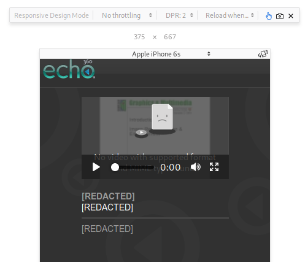
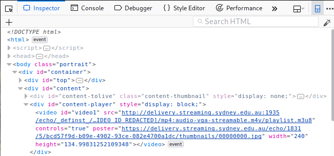

# Echo360 Downloader

Echo360 is a video hosting site.
It actively makes viewing videos much harder than it should be,
by using ~dark rituals~ Flash and other deprecated technologies.

This script allows you to download the videos for offline use.

## Requirements

### Python Requirements

You need Python 3 to run this script.
`requirements.txt` contains the Python packages that are needed.

You can run 
```bash
pip3 install -r requirements.txt
```
to install them automatically.  

### FFmpeg

This program will not work without [FFmpeg](https://ffmpeg.org) installed
and available on your path. If you're not sure how to do this on Windows,
there are instructions available [here](http://adaptivesamples.com/how-to-install-ffmpeg-on-windows).

On OSX, `brew install ffmpeg` will work fine, and on Linux, use your package manager of choice.

## Usage

**NOTE:** On the [auto_url](https://github.com/lyneca/echo360/tree/auto_url) branch, there is a test for
a much easier way to get the m3u8 URL. Download that version, and you may be able to just paste the
first `view.streaming.[base server]/.../echo/presentation/[some_id]` URL in, and it might find the right
one automatically. However, the master branch is by far the most stable.

The hardest part is getting the _playlist URL_. So far, the easiest way I've
found is as follows:

1. **Navigate to the player**. It should have a URL that looks like `/echo/presentation/[some ID]`.
   It's the fullscreen player, with the Apps tab on the right (containing Scenes, Bookmarks, etc.),
   and the video on the right of the screen.
2. Open the Developer Tools. In Chrome/Firefox, this can be done using F12 on Windows, or Cmd+Opt+I on OSX.
   Note that if you have Flash enabled, it may capture the F12 key press.
3. Simulate an iPhone, and **refesh the page**. For some reason, Echo shows a different view to mobile browsers.
   I know that simulating an iPhone X display in particular works. This can be done by
   Ctrl+Shift+M on Windows, or Cmd+Shift+M on OSX.

   
4. Find the delivery URL. Navigate to the Elements tab. If you've done everything right so far,
   you should be able to go through these elements of the HTML tree:
   ```
   html > body > div#container > div#content > div#content-player > video#video1
   ```
   
5. **Copy the delivery url** (the `src="[url]"`) part of the `video#video1` element. This URL ends in `.m3u8`;
   which is a playlist file.
6. Run `python3 download.py`, and paste the delivery URL into the terminal.
7. Enter the output name. This needs to end in a file extenstion that FFMPEG supports - if you don't have a
   preference / don't know what to do, just use `[output].mp4` (where `[output]` is the output name of the
   video file).

If you have any issues, feel free to [submit an issue on Github](https://github.com/lyneca/echo360/issues/new).

If you find another way to get the delivery URL that is easier than this one, _*PLEASE MAKE AN ISSUE!*_ I'd love to know!
